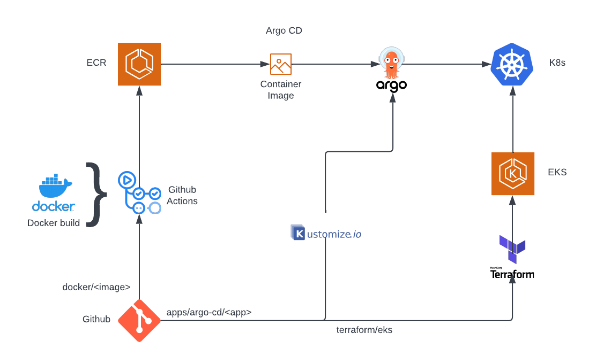

# My EKS cluster



[EKS](terraform/eks)

[ECR](terraform/ecr)

[Argo CD](apps/argo-cd)

[Docker](docker)

## External DNS

https://aws.amazon.com/premiumsupport/knowledge-center/eks-set-up-externaldns/

https://github.com/kubernetes-sigs/external-dns/blob/master/docs/tutorials/aws.md

Policy: MyEksRoute53Manual

```
{
  "Version": "2012-10-17",
  "Statement": [
    {
      "Effect": "Allow",
      "Action": [
        "route53:ChangeResourceRecordSets"
      ],
      "Resource": [
        "arn:aws:route53:::hostedzone/*"
      ]
    },
    {
      "Effect": "Allow",
      "Action": [
        "route53:ListHostedZones",
        "route53:ListResourceRecordSets"
      ],
      "Resource": [
        "*"
      ]
    }
  ]
}
```

```
eksctl create iamserviceaccount --name external-dns --namespace www --cluster "my-eks-1-22" --attach-policy-arn "arn:aws:iam::458891109543:policy/MyEksRoute53Manual" --approve
```

```
2022-07-22 18:34:03 [ℹ]  1 iamserviceaccount (www/external-dns) was included (based on the include/exclude rules)
2022-07-22 18:34:03 [!]  serviceaccounts that exist in Kubernetes will be excluded, use --override-existing-serviceaccounts to override
2022-07-22 18:34:03 [ℹ]  1 task: {
    2 sequential sub-tasks: {
        create IAM role for serviceaccount "www/external-dns",
        create serviceaccount "www/external-dns",
    } }2022-07-22 18:34:03 [ℹ]  building iamserviceaccount stack "eksctl-my-eks-1-22-addon-iamserviceaccount-www-external-dns"
2022-07-22 18:34:04 [ℹ]  deploying stack "eksctl-my-eks-1-22-addon-iamserviceaccount-www-external-dns"
2022-07-22 18:34:04 [ℹ]  waiting for CloudFormation stack "eksctl-my-eks-1-22-addon-iamserviceaccount-www-external-dns"
2022-07-22 18:34:34 [ℹ]  waiting for CloudFormation stack "eksctl-my-eks-1-22-addon-iamserviceaccount-www-external-dns"
2022-07-22 18:34:34 [ℹ]  created serviceaccount "www/external-dns"
```

```
kubectl create --filename externaldns-with-rbac.yaml
```

```
kubectl create --filename externaldns-with-rbac.yaml --namespace www
```
