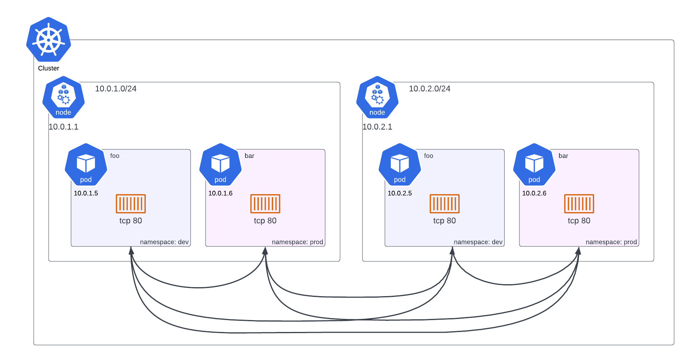

# Rule 1: Pod to pod connectivity

## Every pod can talk to every other pod via the pod's IP address

Note: namespace does not impede this connectivity

prove it:

```
Pod: debug-ubu (default) --> tcp 80 --> Pod: web-skp (dev)
```

```
root@debug-ubu:/# nc -v 172.31.34.199 80
Connection to 172.31.34.199 80 port [tcp/*] succeeded!
```


