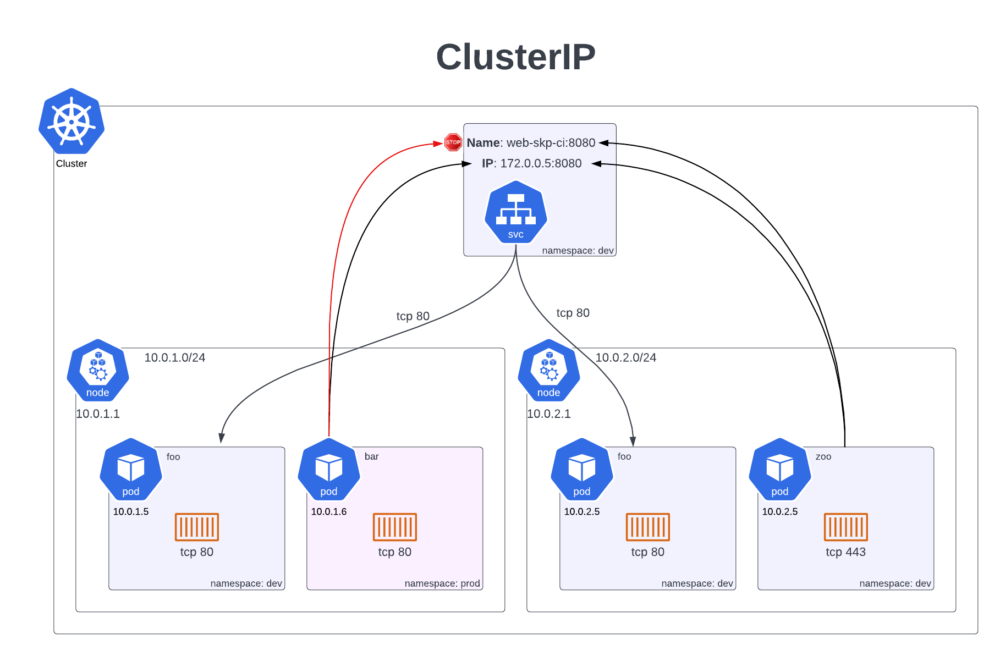

# ClusterIP



## 1. Cluster wide (internal) service IP is available from ANY namespace

prove it:

```
Pod: debug-ubu (default) --> tcp 8080 --> ClusterIP: web-skp-cluster-ip (dev)
```

```
root@debug-ubu:/# nc -v 10.100.208.251 8080
Connection to 10.100.208.251 8080 port [tcp/*] succeeded!
```

## 2. Cluster wide (internal) service NAME is available ONLY within namespace

prove it:

### Within namespace

```
Pod: debug-ubu (dev) --> tcp 8080 --> ClusterIP: web-skp-cluster-ip (dev)
```

```
root@debug-ubu:/# nc -v web-skp-cluster-ip 8080
Connection to web-skp-cluster-ip (10.100.208.251) 8080 port [tcp/*] succeeded!
```

### Outside of namespace

```
Pod: debug-ubu (default) --> tcp 8080 --> ClusterIP: web-skp-cluster-ip (dev)
```

```
root@debug-ubu:/# nc -v web-skp-cluster-ip 8080
nc: getaddrinfo for host "web-skp-cluster-ip" port 8080: Name or service not known
```
