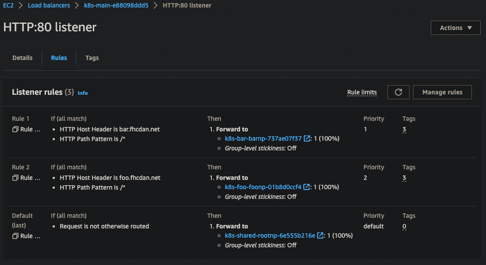

# Ingress

## Ingress rules (AWS ALB)

## Ref

https://docs.aws.amazon.com/eks/latest/userguide/alb-ingress.html

https://kubernetes-sigs.github.io/aws-load-balancer-controller/v2.4/guide/ingress/annotations/#security-groups

### Ingress Groups

https://catalog.workshops.aws/eks-immersionday/en-US/services-and-ingress/multi-ingress

https://kubernetes-sigs.github.io/aws-load-balancer-controller/v2.2/guide/ingress/annotations/#ingressgroup

https://catalog.workshops.aws/eks-immersionday/en-US/services-and-ingress/ingress#5.-create-ingress

