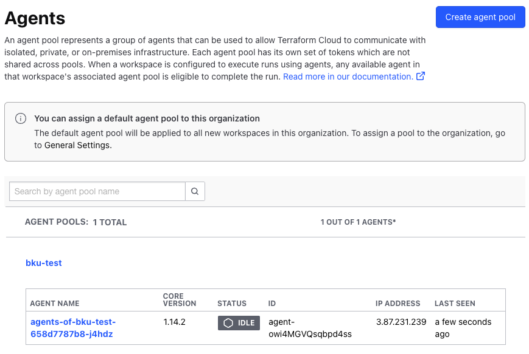

# Terraform Cloud Agent Pool

The Terraform Cloud Agent Pool creates a Terraform Cloud Agent Pool and agent in TFC. An agent pool token is also created, this token is stored as a Kubernetes secret at `tfc-operator-system/bku-test-agent-pool`.

## Requirements

Depends on Terraform Cloud Operator [v2.1.0](https://github.com/hashicorp/terraform-cloud-operator/releases/tag/v2.1.0). The Terraform Cloud Operator must be deployed prior to deploying the TFC Agent Pool.

## Manifests

Manifest based of of this example: https://github.com/hashicorp/terraform-cloud-operator/blob/main/docs/examples/agentPool-deployment.yaml

## Reference

[Manage agent pools with the Terraform Cloud Kubernetes Operator v2](https://developer.hashicorp.com/terraform/tutorials/kubernetes/kubernetes-operator-v2-agentpool)

[GitHub: hashicorp/terraform-cloud-operator: Agent Pool](https://github.com/hashicorp/terraform-cloud-operator/blob/main/docs/agentpool.md)

[Workspace configuration](https://developer.hashicorp.com/terraform/tutorials/cloud/cloud-agents#configure-a-workspace-to-use-agents)
